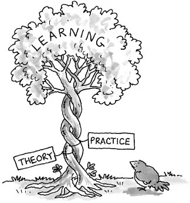

# Science is boring
You may hear this from a lot of children, adult and older people. And classroom textbook don't help much with this remedy. At class 9, students study bohr's model of atom. even at class 7, they study structure of Atom and placement of proton, neutron and electron. Quite remarkable. Our Education system teaches them fundamental things that would be hard for someone to learn own their own outside school. But, at the same time very few people understand how their home appliances work even they work with these appliances everyday. 

- We drink cold water from refrigerator 
- We reheat our food in microwave oven 
- We turn on the AC to beat the heat. 
- We turn on the water motor to fill the roof tank. 
 
 The goal of this project is to 
 - Make science relatable and practical to students. With this accompanying guide, I hope students will find their science textbooks more interesting.
 - Make students aware if their surrounding. we are surrounded by amazing pieces of technology everywhere we go. By understanding how things work, they can maker better purchasing decision, repairing decision, make science projects to complement/improve the existing model. 

 # Science is all around you. And, it makes your life easier.
 This project aims to explain the inner working of common objects that we work with everyday in our kitchen, bedroom, work and many mobile devices that we can't live without. 

 We will start with the common appliances, understand their inner working and many components that work together to bring their magic. In the Last section, we will go further deeper and learn the physics behind those component. 

 For example, 
 - In the first part, we will introduce a motor when talking about car. 
 - In the second part, we will talk about components of the motor 
 - In the third part, we talk about the underlying physics namely electromagnets and magnetic field. 

 This is in contrast with the bottom-up approach that most textbooks take where they introduce the physics and the components and then you will have to take a mechanical engineering degree to understand how a car work. The goal of this project is to write the articles so a 
 - middle school teenager can understand how the world around her works 
 - parent can explain in simple words to their kids how it works and encourage them to explore her surroundings. 

# Outline 
[Part 1](./part1/) talks about the most complex pieces of engineering that we use everyday. We break it down to manageable set of components that we can understand. More importantly, we focus Car and modern computing devices(PC, mobile) and look at components that make them.

[Part 2](./part2/) talks about the parts that play a central role on how car and mobile phone work. 

[Part 3](./part3/) talks about other common household object that we use everyday. e.g. Washing Machine, Water Purifier etc.

[Part4](./part4/) talks about Materials and physical phenomenon that makes the amazing engineering possible. 

