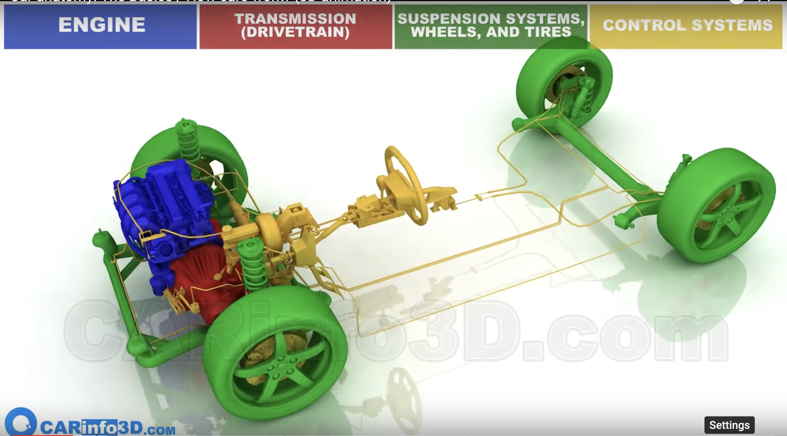

# Overview 
A car is a true engineering marvel which combines decade of engineering innovations and scientific breakthroughs in a single useful thing. Many of us will not be able to imagine their life without it. Here, we will go deep into how a car works and different engineering components that works together to make it a beautiful and seamless product.

# Architecture Diagrams.

Car Subsystems 

Watch the animation video below to understand how a car works. 

https://www.youtube.com/watch?v=fPjOWekzeGI
