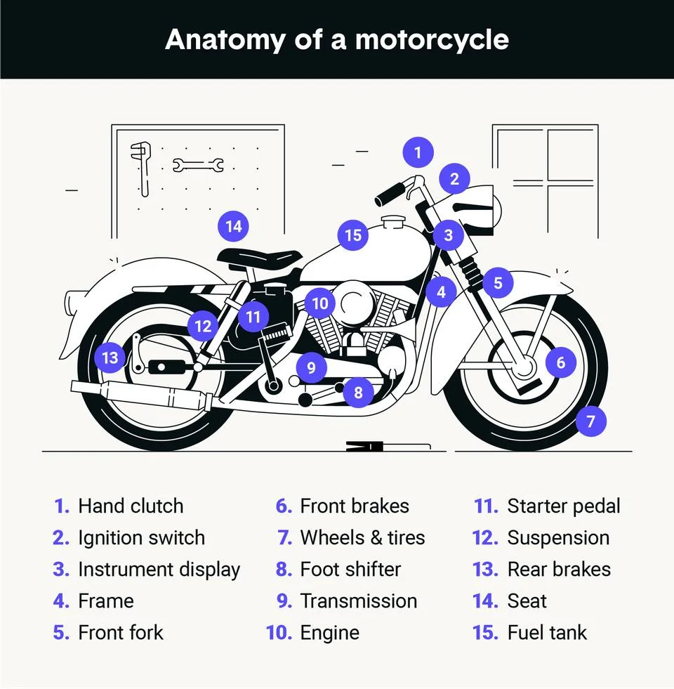

# Overview 
Motorcycle is a simple cousin of the car that we just talked about. It is less complex and slightly easier to understand.

https://www.youtube.com/watch?v=mdOJ717PKRc

Questions 
- What kind of differences did you find between a car and a motorcycle ? 
