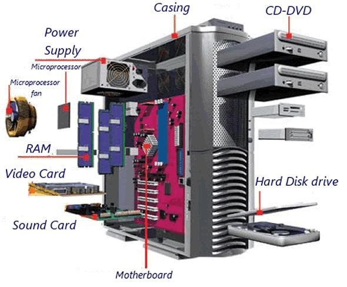

# Overview 
We looked at the mobile in the last session. Here we look at a PC where individual components are little bit more open to see. It mostly has same component as a mobile phone, but components are more visible than the mobile phone.

https://www.youtube.com/watch?v=d86ws7mQYIg
