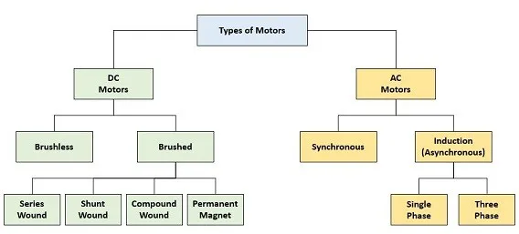
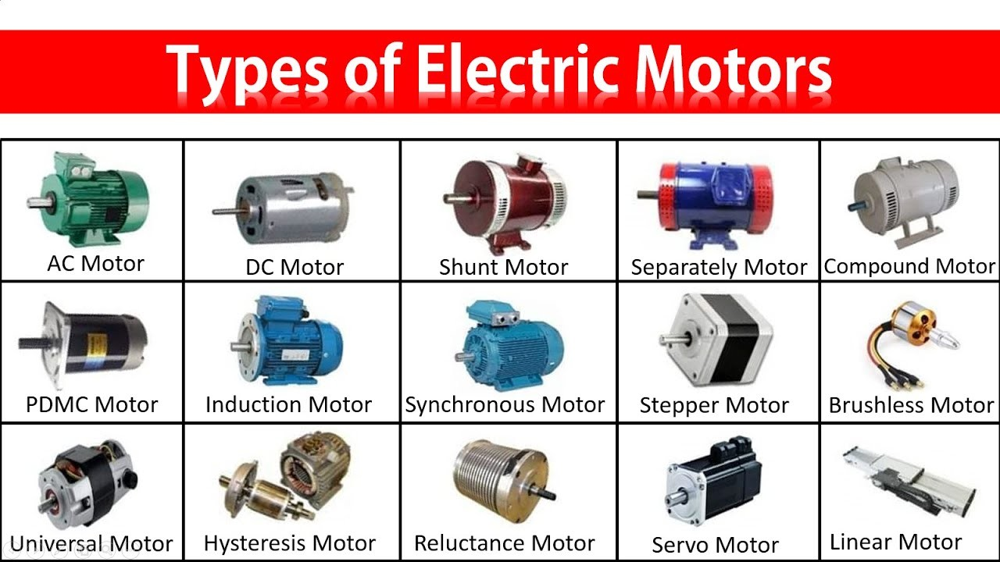

# Overview 

## DC Motors:

* Brushed DC Motors: These motors use a commutator and brushes to provide current flow to the rotor windings. They are relatively simple and commonly used in applications such as toys, small appliances, and automotive systems.
& Brushless DC Motors (BLDC): BLDC motors use electronic commutation instead of brushes. They are efficient, reliable, and widely used in applications such as electric vehicles, drones, and industrial machinery.

## AC Motors:

* Induction Motors: Induction motors are the most commonly used type of AC motor. They operate based on electromagnetic induction and are widely used in industrial applications, HVAC systems, pumps, and compressors.
* Synchronous Motors: Synchronous motors rotate at a constant speed that is synchronized with the frequency of the AC power supply. They are used in applications such as industrial machinery, synchronous clocks, and power factor correction.

--------------

Here it explains how a DC motor works.
https://www.youtube.com/watch?v=1AaUK6pT_cE
